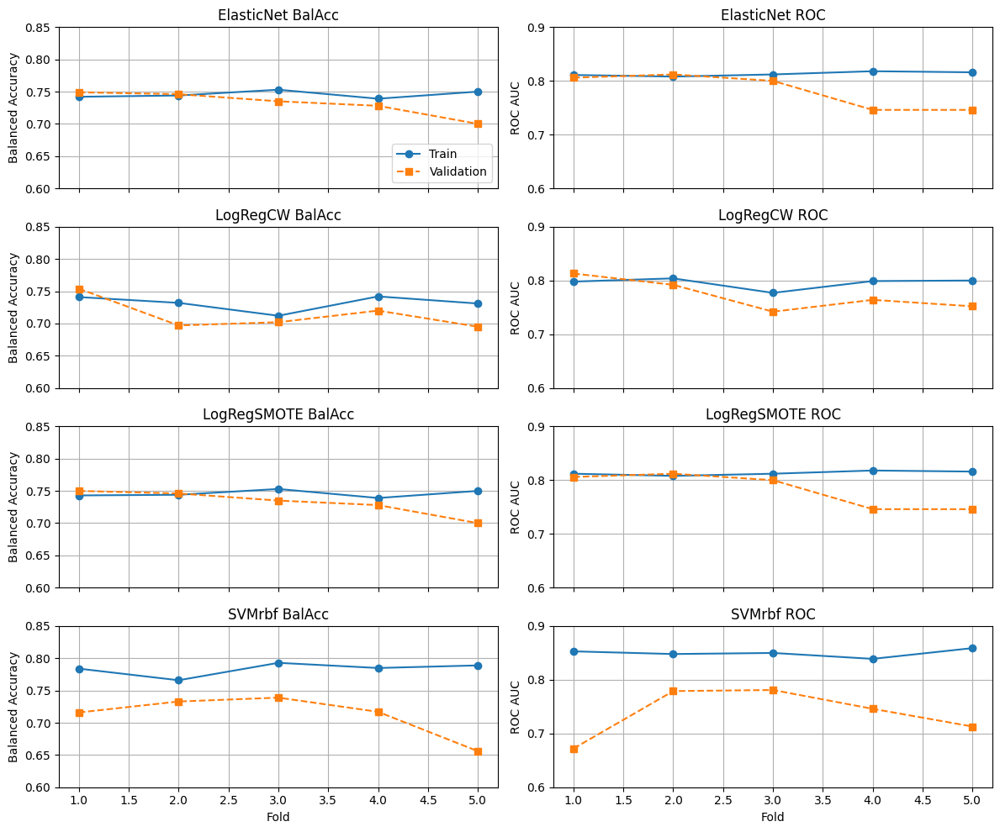
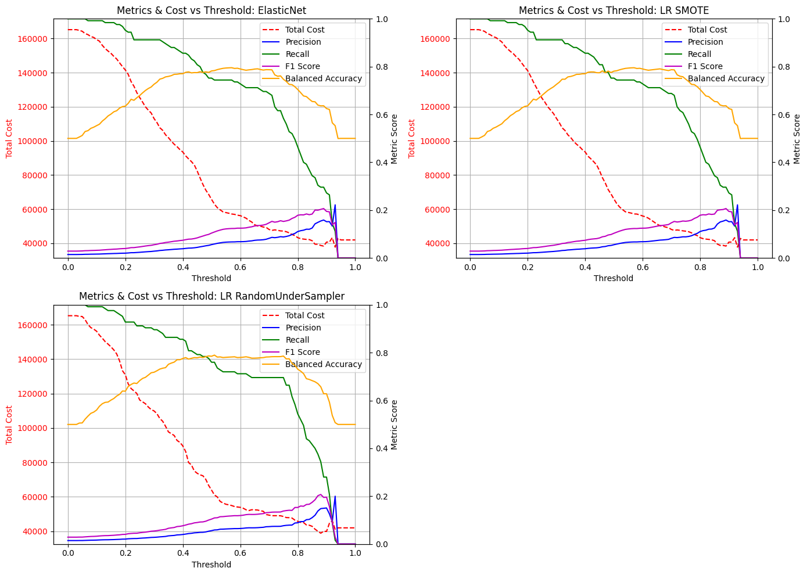

# Insurance Risk Scoring – Which approvals can we trust?

A risk model that explains itself: 57K travel-insurance records, a 1.46% positive rate, and a logistic regression you could defend in a meeting.



[Full report (PDF)](report.pdf) · [Notebook](model/final_model_classification.ipynb) · [Training script](train_model.py)

## Results

- **AUROC 0.83, recall 0.71, balanced accuracy 0.76** in 5-fold stratified CV for Elastic Net logistic regression on WoE features with SMOTE — from a 1.46% base rate.
- **Removing low-IV features helped, slightly:** AUROC 0.828 → 0.830, recall 0.697 → 0.709, balanced accuracy flat at ~0.758. Fewer features, same signal, easier to explain.
- **SVM-RBF looked best on train (AUROC 0.85) and worst on validation (0.67–0.78)** — excluded for overfitting. The chart above is the whole argument.
- **The 0.50 cutoff is the wrong operating point.** Cost-weighted and Youden thresholds land at ~0.58; the report's selected operating point trades to recall 0.63 / balanced accuracy 0.74 for lower total cost.
- Every decision is traceable feature-by-feature through the WoE bins — no black box.

## Context

This project builds an interpretable classification workflow for travel insurance approval decisions. The core problem is operationally realistic: only a small fraction of claims are approved, categorical fields are high-cardinality, and a useful model needs to improve minority-class detection without becoming a black box.

The final recommendation is an Elastic Net logistic regression pipeline trained on Weight of Evidence (WoE) transformed features, filtered with Information Value (IV), and balanced with SMOTE.

### Business trade-off

Insurance approval models sit in a tight trade-off space:

- Missing valid positive cases reduces customer value and can distort downstream decisions.
- Approving too aggressively raises financial exposure.
- Stakeholders usually need a model that is explainable, auditable, and stable under class imbalance.

This project focuses on that trade-off rather than raw leaderboard performance. The modeling choices favor interpretability and controlled risk handling.

## Dataset Snapshot

- Training set: `56,993` rows
- Test set: `6,333` rows
- Input features: `13`
- Target: `claim_status`
- Positive class rate in training data: `1.46%`

The feature set mixes numeric and categorical insurance-related attributes such as `reward`, `customer_score`, `agent_id`, `location`, `product_id`, and `trip_length`.

## Methodology

### 1. Weight of Evidence Encoding

WoE encoding was used to transform both numerical and categorical variables into monotonic predictors aligned with binary risk modeling. This is especially useful in insurance settings where interpretability matters and naive one-hot encoding can explode dimensionality.

### 2. Information Value Filtering

Each WoE-transformed feature was evaluated with IV to retain variables with stronger predictive signal. The project report shows that removing low-IV features slightly improved AUROC while keeping balanced accuracy broadly stable.

### 3. Imbalance Handling

The target class is severely imbalanced, so the workflow compares rebalancing methods. SMOTE performed slightly better than random under-sampling in minority detection metrics and became the preferred balancing strategy for the final recommendation.

### 4. Model Comparison

Three model families were evaluated:

- Logistic Regression
- Elastic Net Logistic Regression
- SVM with RBF kernel

The report concludes that SVM showed overfitting and was excluded from final consideration. Elastic Net and Logistic Regression offered the strongest balance between predictive performance and interpretability.

### 5. Threshold Tuning

The project also evaluates post-model threshold selection, including cost-based and Youden-style operating points. This matters because the best probability cutoff in an imbalanced insurance problem is usually not `0.50`.

## Detailed results

Figures are taken from the final report in this repository.



### WoE + IV Feature Selection

- Elastic Net with all WoE features: AUROC `0.828`
- Elastic Net with low-IV features removed: AUROC `0.830`
- Recall improved from about `0.697` to `0.709` after low-IV removal
- Balanced accuracy remained around `0.758`

### Rebalancing Comparison

- Logistic Regression with SMOTE: AUROC `0.830`, balanced accuracy `0.762`, recall `0.701`
- Logistic Regression with random under-sampling: AUROC `0.828`, balanced accuracy `0.759`, recall `0.697`

### Robustness Assessment

In repeated stratified cross-validation, Elastic Net remained one of the most stable candidates. The report positions it as the best final choice because it preserves interpretability while handling correlated predictors more effectively than plain logistic regression.

### Final Recommendation

The final report recommends **Elastic Net with WoE encoding, IV-based filtering, SMOTE balancing, and a tuned decision threshold** as the best overall business-facing solution.

## Repository Structure

```text
.
|- README.md
|- environment.yml
|- train_model.py
|- report.pdf
|- assets/
|- configuration/
|  |- classification_model.pkl
|  `- parameter/
|     |- ElasticNet_best_params.json
|     `- ElasticNet_youden_threshold.json
|- data/
|  |- insurance_train.csv
|  `- insurance_test.csv
`- model/
   `- final_model_classification.ipynb
```

## How to Reproduce

### Option 1. Re-train from a script

1. Use Python `3.11` for the cleanest reproduction path.
2. Create an environment with either `requirements.txt` or `environment.yml`.
2. Open the repository root as the working directory.
3. Run `python train_model.py`.
4. The script re-trains the Elastic Net + SMOTE pipeline, saves the model to `configuration/classification_model.pkl`, and writes fresh outputs to `outputs/`.

Example on Windows:

```powershell
py -3.11 -m venv .venv
.venv\Scripts\Activate.ps1
python -m pip install -r requirements.txt
python train_model.py
```

Generated outputs include:

- `outputs/insurance_predictions.csv`
- `outputs/training_run_summary.json`
- `outputs/woe_feature_summary.csv`
- `outputs/feature_selection_summary.csv`

If you want to reproduce the report-aligned Elastic Net Youden threshold instead of the saved artifact threshold, run:

```bash
python train_model.py --threshold 0.5788
```

### Option 2. Explore the notebook

Run `model/final_model_classification.ipynb` if you want the walkthrough version with EDA, WoE/IV visuals, and the model-selection narrative. The notebook is the portfolio-facing explanation; `train_model.py` is the cleaner reproducible entrypoint.

## Limitations and Known Inconsistencies

- The notebook is a cleaned portfolio artifact, not a production package.
- The plain script `train_model.py` is the preferred reproducible training entrypoint.
- Python `3.11` is the recommended runtime: `optbinning` and its `ortools` dependency do not install cleanly on Python `3.13`.
- The final PDF report is treated as the source of truth for model selection and threshold narrative.
- The included notebook supports the analysis workflow, but the report contains the fuller evaluation narrative.

## Files to Review First

- `README.md`
- `model/final_model_classification.ipynb`
- `report.pdf`

Course project for *Machine Learning 1* (with Thi Phuong Trang Hoang).
